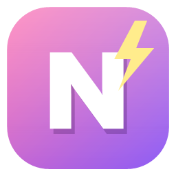
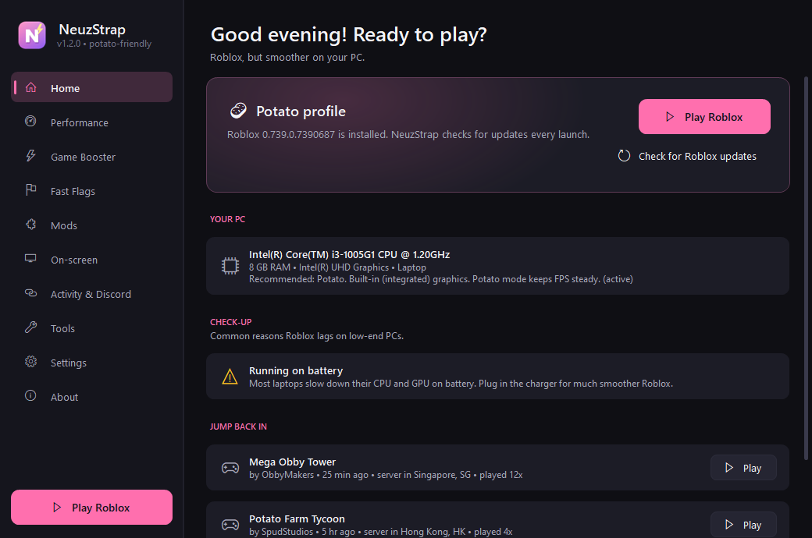
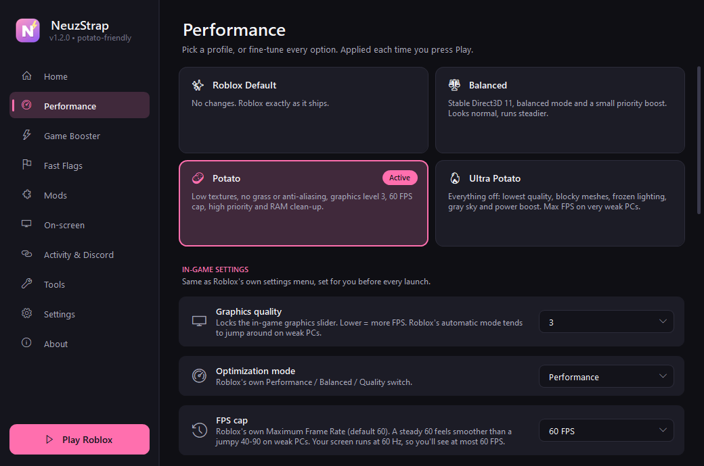
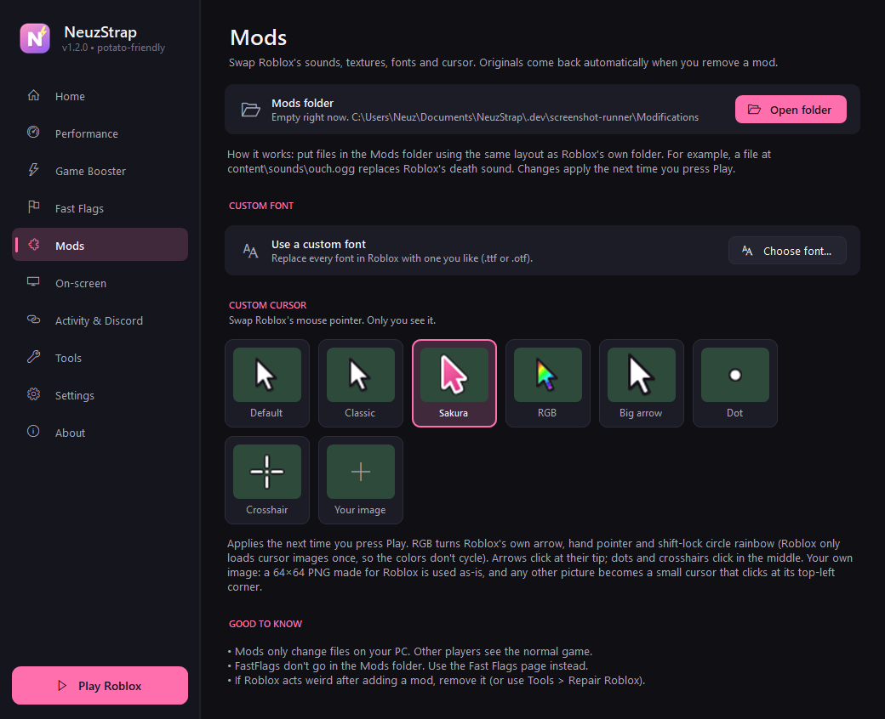
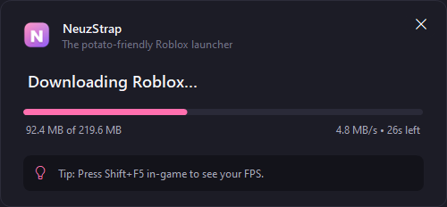
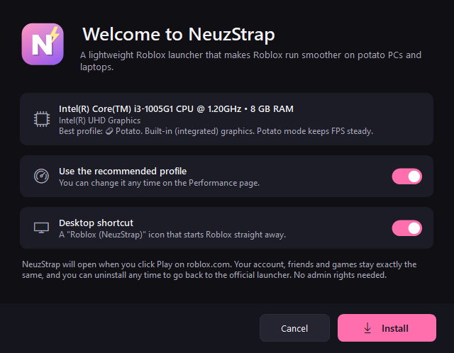

<p align="center">
  
</p>

<h1 align="center">NeuzStrap</h1>

<p align="center">
  <b>The potato-friendly Roblox launcher.</b><br>
  Make Roblox run smoother on low-end PCs and laptops. Free, open source, and about half a megabyte.
</p>

<p align="center">
  <a href="../../releases/latest"><b>Download</b></a> &nbsp;•&nbsp;
  <a href="#features">Features</a> &nbsp;•&nbsp;
  <a href="#faq">FAQ</a> &nbsp;•&nbsp;
  <a href="#building-from-source">Build it yourself</a>
</p>

<p align="center">
  
</p>

## Why NeuzStrap?

Bootstrappers like [Bloxstrap](https://github.com/bloxstraplabs/bloxstrap) replace the official Roblox launcher to add
features. NeuzStrap does that too, but everything in it is built around one question: **how do we make Roblox
playable on a weak PC?**

- **Tiny and dependency-free.** A single ~0.5 MB `NeuzStrap.exe`. It runs on the .NET Framework 4.8 that already
  ships with every Windows 10 and 11 PC, so there's nothing else to install. No admin rights needed.
- **Gets out of the way.** When no background feature is on, NeuzStrap closes the moment Roblox starts, using
  zero RAM while you play. With background features on, it's a small tray process that checks a log file once a second.
- **Only tweaks that actually work.** Since September 2025 Roblox ignores every FastFlag that isn't on its
  [official allowlist](https://devforum.roblox.com/t/allowlist-for-local-client-configuration-via-fast-flags/3966569).
  NeuzStrap's profiles use *only* allowlisted flags plus Roblox's own in-game settings, so no fake "FPS boost" flags that do nothing.
- **Knows your PC.** It scans your CPU, RAM and GPU, recommends a profile and points out common lag causes:
  a missing GPU driver, battery mode, Power saver, a dual-GPU laptop using the weak chip, or a full drive.

## Features



### 🥔 Potato performance
- **One-click profiles**: Roblox Default, Balanced, Potato and Ultra Potato. The best one for your PC is picked automatically.
- **In-game settings, locked before every launch**: graphics level, Roblox's Performance/Balanced/Quality mode and the FPS cap.
  (Roblox's "automatic" graphics tends to jump up and down on weak PCs, and a fixed level feels much smoother.)
- **Rendering**: graphics API (Direct3D 11 / Vulkan / OpenGL), texture quality, anti-aliasing, forced render quality,
  lowest mesh detail, remove grass, freeze lighting, gray sky, exclusive fullscreen, and an experimental lower render resolution.

### ⚡ Game Booster
- Higher **CPU priority** for Roblox.
- **Free up RAM** before launch by asking background apps to hand back unused memory (great on 4-8 GB PCs).
- **Use the strong GPU** on laptops with two graphics chips.
- **Calm background apps**: browsers, game launchers and cloud sync run at lower priority while you play (Discord is left alone).
- **Power boost**: Windows' High performance plan (or Best performance mode) while playing, restored afterwards.
- Disable fullscreen optimizations and turn off Xbox Game Bar background recording.

### 🌏 While you play
- **Server location notice** with the distance to your server. Far server = lag, so rejoin for a closer one.
- **Game history** with one-click rejoin from the Home page.
- **Copy an invite link** to your exact server from the tray icon.
- **Discord Rich Presence** showing your game and its icon, with no setup needed, plus a **Join server** button
  friends can use to land in your exact server.
- **On-screen extras**: Roblox's own FPS counter, plus a click-through overlay with a **CPS counter** and a
  **keyboard display** (static or rainbow, six positions, three sizes).

### 🧹 Tools
- **Cleaner** for logs, temp files, old versions, download caches, leftover official-launcher copies and the asset cache
  (it can be gigabytes on a small SSD).
- **Repair Roblox**, update on demand, and a check that the website's Play button still opens NeuzStrap.
- **Mods**: drop files into the Mods folder to replace sounds and textures, use a **custom font**, or pick a
  **custom cursor** (built-in styles, an RGB rainbow version of Roblox's own cursors, or your own image).
  Originals come back automatically.
- **Close Roblox** button: while Roblox is open, Play turns into Close, which shuts every Roblox window and leftover process.
- **FastFlag editor** that marks which flags Roblox accepts, with import from JSON or straight from Bloxstrap.

### 🔧 A solid bootstrapper
- **Updates itself** from GitHub Releases in the background, so you always have the newest version without doing anything.
- Downloads Roblox from **Roblox's official servers** with MD5 checks, 3 parallel downloads, **resumable** files and automatic mirror fallback.
- Checks free disk space first, keeps playing on your current version if an update fails, and works offline once installed.
- Takes the Play button back if the official launcher grabs it, and can make the official "Roblox Player" shortcuts open
  through NeuzStrap too. The uninstaller puts both back.

<p align="center">
  
</p>

<p align="center">
  
  &nbsp;
  
</p>

## Install

1. Download **`NeuzStrap.exe`** from the [latest release](../../releases/latest).
2. Run it and click **Install**. It takes a second, and you don't need admin.
3. Press **Play** on roblox.com, or use the new **Roblox (NeuzStrap)** desktop icon. Roblox downloads on the first launch (about 220 MB).

> **Windows SmartScreen** may warn about a new, unsigned app. Click **More info → Run anyway**, or
> [build it yourself](#building-from-source) from this source code.

## Discord Rich Presence

Works out of the box. Keep the Discord app open and your friends see **Playing Roblox** with the game's name, icon,
how long you've been playing and a "View game" button. Turn it off (or use your own Discord application ID)
under **Activity & Discord**.

## FAQ

**Will I get banned?**
NeuzStrap never touches the game's memory or injects anything. It downloads the official client from Roblox's own
servers and only changes things Roblox lets players change: the in-game settings file and FastFlags on Roblox's
allowlist. Roblox has said that other flags in `ClientAppSettings.json` are simply ignored, with no consequences.

**How much FPS will I get?**
It depends on the PC and the game. The biggest wins on weak hardware usually come from a fixed low graphics level,
Performance mode, lower textures, no anti-aliasing, no grass and frozen lighting (the Ultra Potato profile), plus
plugging in your laptop charger. Press **Shift+F5** in-game to see your FPS.

**Does it work on Windows 7 or 8?**
No. Roblox itself needs Windows 10 or 11.

**Where are my files?**
`%LocalAppData%\NeuzStrap`: settings, logs, mods and NeuzStrap's copy of Roblox.
Put a file called `portable.txt` next to `NeuzStrap.exe` to keep everything in that folder instead.

**How do I uninstall?**
**Settings → Uninstall**, or Windows **Settings → Apps**. The Play button goes back to the official Roblox launcher.

## Building from source

You need the [.NET SDK](https://dotnet.microsoft.com/download) 8 or newer on Windows (the app itself targets .NET Framework 4.8).

```powershell
powershell -ExecutionPolicy Bypass -File build.ps1   # runs the tests, then builds artifacts\NeuzStrap.exe
```

| Command-line option | What it does |
| --- | --- |
| *(none)* | Opens NeuzStrap (or the installer if it isn't installed yet) |
| `-player [link]` | Launches Roblox (what the website's Play button runs) |
| `-update` / `-repair` | Updates / reinstalls Roblox without launching it |
| `-settings [-page performance]` | Opens a specific page |
| `-uninstall [-quiet]` | Removes NeuzStrap |
| `-screenshot <folder> [-demo]` | Renders every window to PNG (used for this README) |

Handy scripts in `tools/`:

- `screenshots.ps1 -Out docs/screenshots -Demo` regenerates these screenshots with a sample laptop (so your own PC details never end up in the docs).
- `make-icon.ps1` redraws the app icon.
- `ascii-source.py` keeps the C# sources plain ASCII (icon glyphs become `\uXXXX` escapes).

```
src/NeuzStrap
  Core/          settings, JSON, logging, paths, HTTP
  Roblox/        version API, downloader/installer, FastFlags, mods, protocol handler, in-game settings
  Boost/         hardware scan, profiles, Game Booster, power plan, cleaner, check-up
  Integrations/  log watcher, Discord RPC, server location, Roblox web API
  Launch/        the Play pipeline and the background session
  Setup/         installing / updating NeuzStrap itself
  UI/            custom dark WinForms controls, windows and pages
tests/NeuzStrap.Tests   xUnit tests
```

## Credits

Inspired by [Bloxstrap](https://github.com/bloxstraplabs/bloxstrap) (MIT) and the Roblox bootstrapper community.
NeuzStrap is written from scratch for low-end PCs.

NeuzStrap is not affiliated with, endorsed by, or connected to Roblox Corporation or Bloxstrap.
"Roblox" is a trademark of Roblox Corporation.

## License

[MIT](LICENSE). Use it, share it, fork it, make Roblox smoother for someone. 💗
